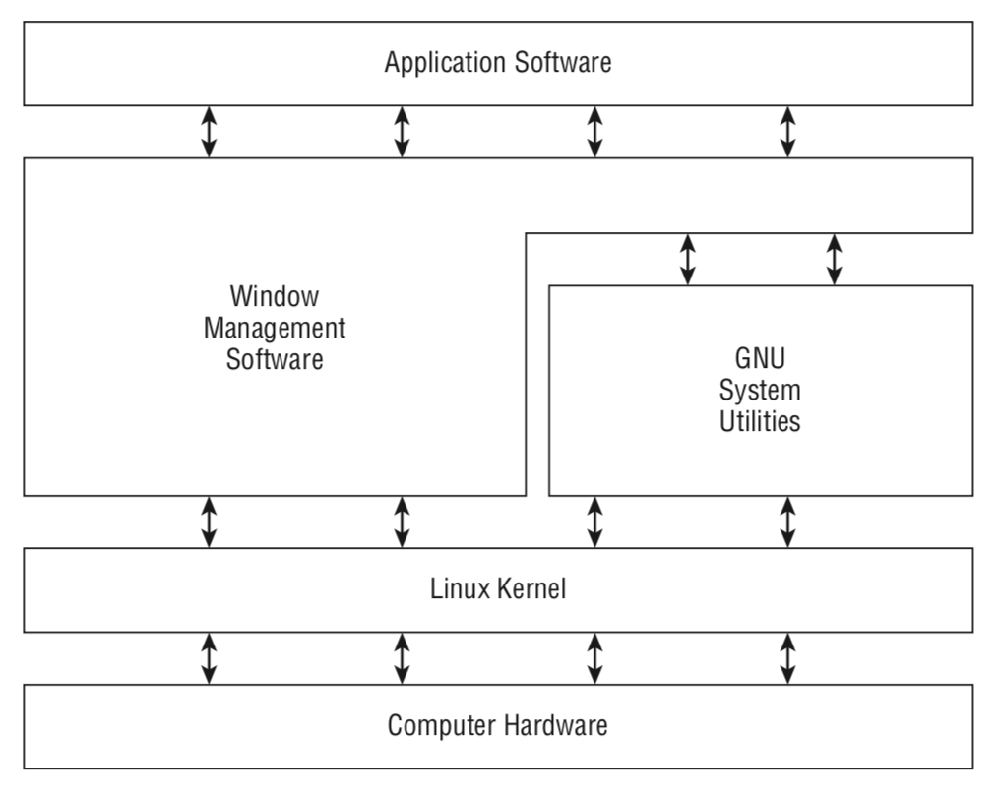

# Chapter 01 Starting with Linux Shells

<\br>

## Introduction

   - What is Linux?
   - Parts of the Linux kernel
   - Exploring the Linux desktop
   - Visiting Linux distributions

---

## 1. What is Linux?
   -  Linux system has four main parts:
      - The Linux kernel
      - The GNU utilities
      - A graphical desktop environment
      - Application software
      - {:height="254px" width="203px"}
   1.  